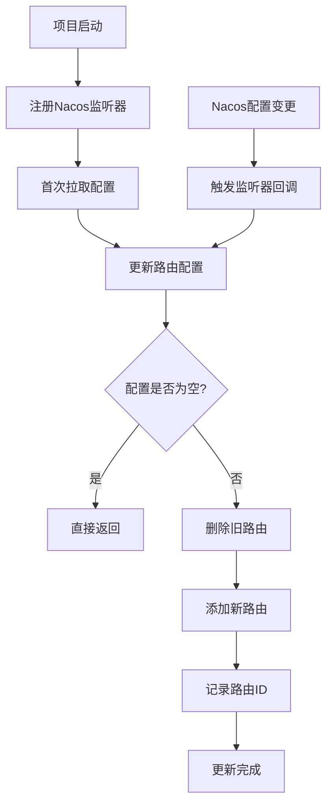

# 🔄 DynamicRouteLoader 动态路由加载器

## 📝 **一句话总结**
基于Nacos配置中心实现网关路由动态更新，无需重启网关服务

## 🔄 **流程图**


## 🎯 **核心功能**
1. **👂 配置监听** - 监听Nacos中网关路由配置变化
2. **🔄 动态更新** - 实时更新网关路由规则
3. **🧹 清理机制** - 先删除旧路由再添加新路由

## 📁 **配置文件结构**
```json
// gateway-routes.json
[
  {
    "id": "user-service",
    "predicates": [{
      "name": "Path",
      "args": {"pattern": "/user/**"}
    }],
    "filters": [{
      "name": "StripPrefix",
      "args": {"parts": 1}
    }],
    "uri": "lb://user-service",
    "order": 0
  }
]
```

## ⚙️ **配置参数**
| 参数 | 值 | 说明 |
|------|-----|------|
| dataId | gateway-routes.json | 配置文件名称 |
| group | DEFAULT_GROUP | Nacos配置组 |
| 超时时间 | 5000ms | 配置获取超时 |

## 🛠️ **实现步骤**
```java
// 1. 注册监听器（监听配置变化）
configService.getConfigAndSignListener(dataId, group, timeout, listener)

// 2. 首次加载配置
updateConfigInfo(initialConfig)

// 3. 更新路由逻辑
// 3.1 删除所有旧路由
for (routeId in routeIds) {
    routeDefinitionWriter.delete(routeId)
}

// 3.2 添加所有新路由
for (routeDefinition in routeDefinitions) {
    routeDefinitionWriter.save(routeDefinition)
    routeIds.add(routeDefinition.getId())
}
```

## 📦 **最小实现模板**
```java
@Component
@RequiredArgsConstructor
public class DynamicRouteLoader {
    
    private final String DATA_ID = "gateway-routes.json";
    private final String GROUP = "DEFAULT_GROUP";
    
    private final RouteDefinitionWriter routeDefinitionWriter;
    private final NacosConfigManager nacosConfigManager;
    private final Set<String> routeIds = new HashSet<>();
    
    @PostConstruct
    public void init() throws NacosException {
        // 注册监听器
        nacosConfigManager.getConfigService()
            .getConfigAndSignListener(DATA_ID, GROUP, 5000, 
                configInfo -> updateRoutes(configInfo));
    }
    
    private void updateRoutes(String configJson) {
        // 1. 删除旧路由
        routeIds.forEach(id -> 
            routeDefinitionWriter.delete(Mono.just(id)).subscribe());
        routeIds.clear();
        
        // 2. 解析并添加新路由
        List<RouteDefinition> routes = JSONUtil.toList(configJson, RouteDefinition.class);
        if (!CollUtils.isEmpty(routes)) {
            routes.forEach(route -> {
                routeDefinitionWriter.save(Mono.just(route)).subscribe();
                routeIds.add(route.getId());
            });
        }
    }
}
```

## 🔍 **工作原理解析**
```
启动时:
1. 注册监听器到Nacos
2. 拉取初始配置
3. 解析JSON为路由定义
4. 注册路由到Gateway

运行时（配置变更）:
1. Nacos推送新配置
2. 触发监听器回调
3. 清空当前路由
4. 注册新路由
```

## ⚠️ **注意事项**
1. **幂等性设计**：先删除所有旧路由，避免重复
2. **异步操作**：`subscribe()` 异步执行路由操作
3. **ID管理**：使用Set保存路由ID，方便清理
4. **空配置处理**：检查配置是否为空，避免空指针
5. **JSON格式**：严格遵循RouteDefinition的JSON结构

## 📊 **路由配置示例**
```json
{
  "id": "订单服务路由",
  "uri": "lb://order-service",
  "predicates": [
    {"name": "Path", "args": {"_genkey_0": "/orders/**"}}
  ],
  "filters": [
    {"name": "StripPrefix", "args": {"parts": 1}}
  ]
}
```

## 🔧 **调试技巧**
1. **查看日志**：监听器触发时会打印配置信息
2. **手动刷新**：在Nacos控制台修改配置测试
3. **路由验证**：访问 `/actuator/gateway/routes` 查看当前路由
4. **配置回滚**：Nacos支持配置版本回退

---

**核心记忆点：监听Nacos → 删除旧路由 → 添加新路由 → 记录ID**