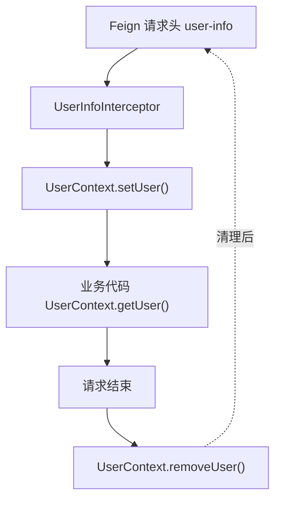

# 用户信息拦截器（UserInfoInterceptor）

## 一、这个类是干什么的
在 **服务接收到 HTTP 请求时**，
从请求头中读取 `user-info`，并保存到 `UserContext`（ThreadLocal）中，
让 Controller / Service 层可以直接获取当前用户信息。


---

## 二、解决的问题
- 微服务调用中，用户信息通过请求头传递
- 业务代码中频繁需要 `userId`
- 不希望在每个 Controller 方法里手动解析请求头


---

## 三、最小实现代码
```java
@Component
public class UserInfoInterceptor implements HandlerInterceptor {

    @Override
    public boolean preHandle(HttpServletRequest request,
                             HttpServletResponse response,
                             Object handler) {
        String userInfo = request.getHeader("user-info");
        if (StrUtil.isNotBlank(userInfo)) {
            UserContext.setUser(Long.valueOf(userInfo));
        }
        return true;
    }

    @Override
    public void afterCompletion(HttpServletRequest request,
                                HttpServletResponse response,
                                Object handler,
                                Exception ex) {
        UserContext.removeUser();
    }
}
```


---

## 四、执行时机
```text
HTTP 请求进入
  → preHandle()
  → Controller / Service
  → afterCompletion()
  → 请求结束
```


---

## 五、数据流向


---

## 六、为什么一定要 removeUser
* Web 容器线程是复用的
* ThreadLocal 不会自动清空
* 不清理会导致用户信息串号


---

## 七、使用前提（必须）

### 1. 拦截器被 Spring 管理
```java
@Component
public class UserInfoInterceptor implements HandlerInterceptor {}
```

### 2. 注册到 Spring MVC
```java
@Configuration
public class WebConfig implements WebMvcConfigurer {

    @Autowired
    private UserInfoInterceptor userInfoInterceptor;

    @Override
    public void addInterceptors(InterceptorRegistry registry) {
        registry.addInterceptor(userInfoInterceptor)
                .addPathPatterns("/**");
    }
}
```


---

## 八、一句话速记（面试版）
通过 Spring MVC 拦截器统一解析请求头中的用户信息，
并使用 ThreadLocal 保存到 UserContext，
实现微服务中用户上下文的安全传递。
